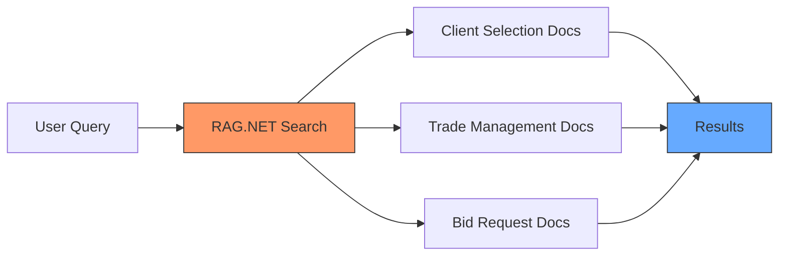

# Building a Smart Search for Hedge Platform Documentation 🚀

## Introduction
In this tutorial, we'll implement RAG.NET to create an intelligent search system for a Hedge Platform application's documentation. We'll focus on three main pages:
- Client Selection Page
- Trade Management Page
- Bid Request Page

By the end of this tutorial, you'll have a fully functional system that can understand and retrieve relevant documentation based on user queries, even with typos or variations in terminology.

## Overview

### What We'll Build 🎯


### Key Features 🔍
- Smart concept organization for hedge platform documentation
- Fuzzy matching for user-friendly search
- Relevance-based result ranking
- Context-aware document retrieval

## Quick Complete Example

Here's a preview of what we'll build:

```csharp
// 1. Initialize services
var services = new ServiceCollection()
    .AddRAGFramework()
    .BuildServiceProvider();

var conceptStore = services.GetRequiredService<ConceptStore>();
var vectorStore = services.GetRequiredService<VectorStore>();
var searchService = services.GetRequiredService<SearchService>();

// 2. Create concepts for each page
var clientSelectConcept = new Concept
{
    Id = "client-select",
    Name = "Client Selection Page",
    Description = "Documentation for client selection functionality",
    Documents = new List<Document>
    {
        new Document
        {
            Id = "client-select-main",
            Content = """
                The Client Selection page allows users to search and select clients
                for hedge operations. Features include:
                - Client search by name or ID
                - Filter by client type
                - View client portfolio details
                """
        }
    }
};

conceptStore.AddConcept(clientSelectConcept);
// [Additional concepts for other pages...]

// 3. Build vector store
await vectorStore.BuildVectorStoreAsync();

// 4. Perform search
var searchResult = await searchService.SearchAsync(
    "how do I select a client for trading?",
    new SearchOptions
    {
        MinimumScore = 0.3,
        MaxResults = 3
    }
);

// 5. Process results
foreach (var prediction in searchResult.Predictions)
{
    Console.WriteLine($"\nFound match in: {prediction.Concept.Name}");
    Console.WriteLine($"Relevance: {prediction.Score:P2}");
    Console.WriteLine("Content:");
    Console.WriteLine(prediction.Concept.Documents.First().Content);
}
```

## What's Next? 📝
In the upcoming sections, we'll break down each step in detail:

1. **Concept Creation**
    - Organizing page documentation
    - Creating meaningful relationships
    - Adding metadata for better context

2. **Search Configuration**
    - Setting appropriate thresholds
    - Configuring fuzzy matching
    - Optimizing for hedge platform terminology

3. **Search Implementation**
    - Building search queries
    - Handling common variations
    - Processing results effectively

4. **Content Extraction**
    - Ranking and filtering results
    - Formatting for presentation
    - Handling different content types

Each section will include:
- Step-by-step instructions
- Complete code examples
- Best practices
- Common pitfalls to avoid
- Testing strategies

## Prerequisites 📋
Before we begin, ensure you have:
- .NET 8.0 SDK installed
- Basic C# knowledge
- RAG.NET package referenced in your project
- Basic understanding of hedge platform concepts

## Getting Started 🚀
```bash
# Create new project
dotnet new console -n HedgePlatformSearch

# Add RAG.NET package reference
dotnet add package RAG.NET

# Open in your favorite editor
code HedgePlatformSearch
```

Ready to begin? Let's start with the first step: creating concepts and documents for our hedge platform pages!