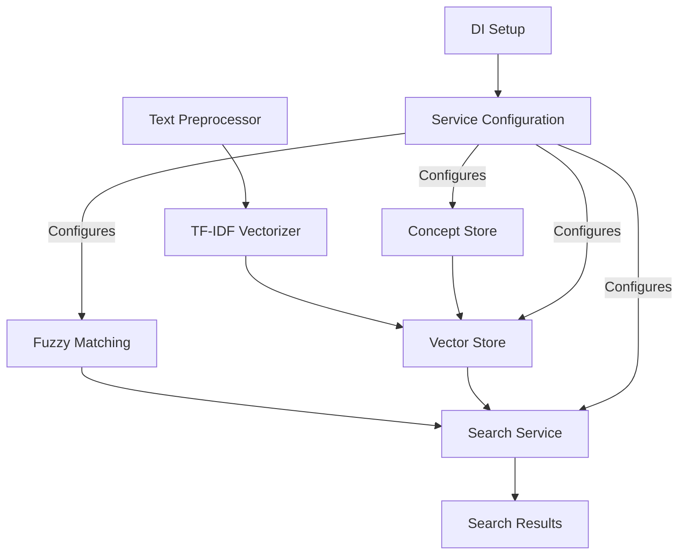

# RAG.NET Framework Documentation Overview 📚

## Table of Contents

1. [Main README](#main-readme)
2. [Data Structures](#data-structures)
3. [Vector Store](#vector-store)
4. [TF-IDF Vectorizer](#tf-idf-vectorizer)
5. [Fuzzy Matching System](#fuzzy-matching)
6. [Search Service](#search-service)
7. [Concept Store](#concept-store)
8. [Text Preprocessor](#text-preprocessor)
9. [Dependency Injection Setup](#di-setup)

## Section Summaries

### Main README
The primary documentation introducing RAG.NET, its core features, and basic usage. Covers:
- Core features overview
- Quick start guide
- Integration with LLMs
- Basic usage examples
- Concept architecture
  ➡️ [View Full Documentation](main-readme.md)

### Data Structures
Documentation of all data model classes used throughout the framework:
- Concept and Document models
- Prediction models
- Configuration classes
- Training data structures
  ➡️ [View Full Documentation](data-structures.md)

### Vector Store
Core component for document vectorization and similarity search:
- TF-IDF vector management
- Parallel processing
- Similarity calculations
- Concept prediction
  ➡️ [View Full Documentation](vector-store.md)

### TF-IDF Vectorizer
Text vectorization engine using Term Frequency-Inverse Document Frequency:
- Document vectorization
- Similarity calculations
- ML.NET integration
- Text transformation pipeline
  ➡️ [View Full Documentation](tfidf-vectorizer.md)

### Fuzzy Matching
System for handling typos and text variations:
- Levenshtein distance implementation
- Query term expansion
- Caching mechanisms
- Configurable matching thresholds
  ➡️ [View Full Documentation](fuzzy-matching.md)

### Search Service
High-level service for performing intelligent searches:
- Query processing
- Result ranking
- Error handling
- Search configuration
  ➡️ [View Full Documentation](search-service.md)

### Concept Store
Repository for managing concepts and their documents:
- Concept management
- Document organization
- Thread-safe operations
- Relationship handling
  ➡️ [View Full Documentation](concept-store.md)

### Text Preprocessor
Text normalization and tokenization service:
- Text cleaning
- Tokenization
- Whitespace handling
- Case normalization
  ➡️ [View Full Documentation](text-preprocessor.md)

### Dependency Injection Setup
Configuration and service registration documentation:
- Service registration
- Configuration options
- Lifetime management
- Environment-based setup
  ➡️ [View Full Documentation](di-setup.md)

## Component Relationships

## Quick Navigation Tips 🎯

1. **New to RAG.NET?**
    - Start with the Main README
    - Then review Data Structures
    - Follow with Search Service documentation

2. **Implementing Search?**
    - Review Search Service
    - Study Vector Store
    - Check Fuzzy Matching

3. **Setting Up the Project?**
    - Start with DI Setup
    - Review Concept Store
    - Check configuration options

4. **Tuning Performance?**
    - Review Vector Store
    - Check TF-IDF Vectorizer
    - Study Text Preprocessor

Each component is designed to work seamlessly together while maintaining separation of concerns. The documentation provides both high-level overviews and detailed implementation guidance.

## Support and Resources

For additional help:
- Check the individual documentation sections
- Review the code examples
- Follow the best practices in each section
- Refer to the integration patterns

---

Documentation last updated: November 8, 2024