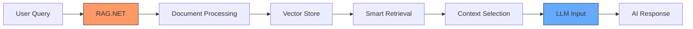

# 🚀 RAG.NET - Supercharge Your Document Search

Welcome to RAG.NET, my latest adventure into building a powerful Retrieval-Augmented Generation framework for .NET! If you've ever wanted to build intelligent document search with fuzzy matching and ML-powered concept understanding, you're in the right place.

## ✨ What's Inside?

RAG.NET brings together some seriously cool features:

- 🧠 **Smart Concept Understanding**: Uses TF-IDF vectorization to understand document relationships
- 🔍 **Fuzzy Search Magic**: Handles typos and variations like a champ
- 🎯 **Concept-Based Retrieval**: Finds relevant documents even when queries aren't exact matches
- ⚡ **Blazing Fast**: Built with parallel processing and smart caching

## 🎯 Why RAG.NET?

Ever tried searching for "machine lerning" and got zero results? Frustrating, right? RAG.NET handles these scenarios beautifully:

```csharp
// Even with typos, we'll find the right content!
var results = await searchService.SearchAsync("artficial intellignce");

// Results will include matches for "artificial intelligence" 
// thanks to our fuzzy matching system!
```

## 🎯 Core Concept Architecture

The heart of RAG.NET is its concept-document relationship system. Think of concepts as smart containers that understand their content:

```csharp
// Create a concept for Machine Learning
var mlConcept = new Concept
{
    Id = "ml",
    Name = "Machine Learning",
    Description = "AI and ML concepts",
    Metadata = new Dictionary<string, string>
    {
        { "category", "artificial-intelligence" },
        { "difficulty", "advanced" }
    }
};

// Add related documents to the concept
mlConcept.Documents.Add(new Document
{
    Id = "ml-intro",
    Content = "Machine learning enables computers to learn from data...",
    Metadata = new Dictionary<string, string>
    {
        { "author", "John Doe" },
        { "last_updated", "2024-01-01" }
    }
});

// Add to your concept store
conceptStore.AddConcept(mlConcept);
```

### Why Concepts Matter?

Concepts in RAG.NET aren't just folders for documents - they're intelligent collections that:

1. **Group Related Content**: Documents about similar topics stay together
2. **Share Context**: All documents in a concept contribute to its understanding
3. **Enable Smart Search**: When you search for "ML", we know to look in related documents too
4. **Support Metadata**: Both concepts and documents can have metadata for extra context

## 🚀 Quick Start

```csharp
// 1. Set up your concept store
var mlConcept = new Concept
{
    Id = "ml",
    Name = "Machine Learning",
    Description = "AI and ML concepts"
};

mlConcept.Documents.Add(new Document
{
    Content = "Machine learning enables computers to learn from data..."
});

conceptStore.AddConcept(mlConcept);

// 2. Build the vector store
await vectorStore.BuildVectorStoreAsync();

// 3. Start searching!
var results = await searchService.SearchAsync("neural neworks");
```

## 🔥 Core Features Deep Dive

### TF-IDF Vectorization
We use Term Frequency-Inverse Document Frequency (TF-IDF) to understand document importance:

```csharp
var vectorizer = new TfIdfVectorizer();
vectorizer.Fit(documents); // Learns from your document collection
var documentVector = vectorizer.Transform(newDocument);
```

### Fuzzy Matching
Our Levenshtein-based matching handles various text variations:

```csharp
var fuzzyService = new FuzzyMatchService(matcher, options);
var expandedTerms = fuzzyService.ExpandTerms("neural", vocabulary);
// Returns: ["neural", "neuronal", "neurons", ...]
```

### Concept-Based Search
Instead of simple keyword matching, we understand relationships between concepts:

```csharp
var searchOptions = new SearchOptions
{
    MinimumScore = 0.1,
    MaxResults = 5
};

var results = await searchService.SearchAsync(
    "machine learning algorithms",
    searchOptions
);
```

## 🤖 Supercharging Your LLM Pipeline

### Why RAG.NET + LLMs?

RAG.NET isn't just another search engine - it's your AI's best friend! Here's why it's a game-changer for your LLM pipeline:



### 🎯 High-Relevance Context Selection

Traditional search might miss crucial context, but RAG.NET ensures your LLM gets the most relevant information:

```csharp
// Example: Processing a user query for an LLM
var query = "What are the latest deep learning developments in our project?";

// Get highly relevant context using RAG.NET
var searchResults = await searchService.SearchAsync(query);

// Format context for your LLM
var llmContext = searchResults.Predictions
    .OrderByDescending(p => p.Score)
    .Take(3)  // Top 3 most relevant concepts
    .SelectMany(p => p.Concept.Documents)
    .Select(d => d.Content);
```

### 🚀 Benefits for LLM Integration

1. **Reduced Token Usage**:
    - Only send the most relevant context to your LLM
    - Save on API costs by filtering out noise

2. **Improved Answer Quality**:
    - Better context = better answers
    - Reduced hallucinations through relevant document grounding

3. **Smart Context Ranking**:
    - Use scores to prioritize most relevant information
    - Dynamically adjust context based on relevance

### 🔄 Real-World LLM Integration Example

Here's how RAG.NET fits into a complete LLM pipeline:

```csharp
public async Task<string> GetAIResponse(string userQuery)
{
    // 1. Get relevant context using RAG.NET
    var searchResults = await searchService.SearchAsync(
        userQuery,
        new SearchOptions 
        { 
            MinimumScore = 0.6,
            MaxResults = 3
        }
    );

    // 2. Prepare context for LLM
    var relevantDocs = searchResults.Predictions
        .OrderByDescending(p => p.Score)
        .SelectMany(p => p.Concept.Documents)
        .Select(d => d.Content);

    // 3. Format your LLM prompt
    var prompt = $"""
        You are an AI assistant with access to the following relevant documentation:

        {string.Join("\n---\n", relevantDocs)}

        Using ONLY the information provided above, please answer:
        {userQuery}

        If the provided context doesn't contain enough information to answer,
        please say so rather than making assumptions.
        """;

    // 4. Send to your favorite LLM
    return await yourLLMService.GetCompletion(prompt);
}
```

## 💡 Get Started

Ready to supercharge your document search? Clone this repo and dive in! Check out the examples folder for more detailed usage scenarios.

```bash
git clone https://github.com/yourusername/rag-net.git
cd rag-net
dotnet build
```

---

Built with ❤️ using .NET 8.0 and Microsoft.ML
